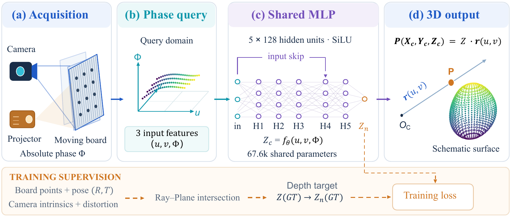
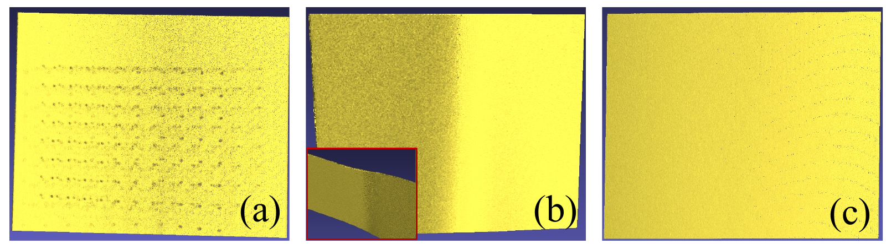
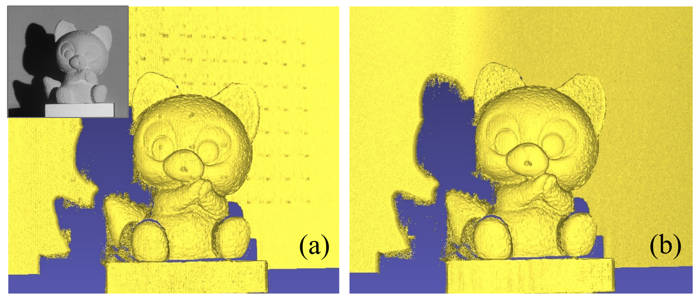

# Spatial Phase Query Fields (SPQF)

This repository contains the code for phase-to-depth calibration with a fixed camera-projector system. The main model is a shared MLP that takes pixel coordinates and absolute phase as input. Polynomial calibration is also included for comparison.



## Quick start

```bash
python -m pip install -r requirements.txt

bash tools/train.sh  # Train a model or fit a polynomial
bash tools/test.sh   # Evaluate calibration-board poses
bash tools/infer.sh  # Reconstruct a new object
```

The scripts are configured by editing the variables near the top of each file. They do not take command-line arguments. Run them from this directory. Python 3.10 or newer is recommended.

The dataset and pretrained models are not included. Set the paths in the scripts to your own data before running them.

## Project structure

```text
tools/                 Shell entry points
codes/phase_field/     Python implementation and tests
data/                  Phase data and calibration manifests
cal/                   Calibration images and masks
legacy/matlab/         Original MATLAB code
docs/images/           Figures used in this README
```

## Data

For calibration, phase files should be stored as MATLAB files containing an unwrapped absolute phase array in radians:

```text
data/raw_phase_no_mask/PSP_1.mat ... PSP_24.mat
data/camera_numeric.mat
cal/mask/mask_1.bmp ... mask_24.bmp   # optional
```

The included manifest is for the original 24-pose dataset. For a new camera or new board poses, prepare a manifest first:

```bash
bash tools/prepare_manifest.sh
```

If the phase has not been extracted yet, configure and run:

```bash
bash tools/extract_raw_phase.sh
```

Optional phase processing, such as CPC fitting or synthetic noise, is available through `tools/generate_phase.sh`.

## Training and evaluation

Edit `tools/train.sh` to choose the phase directory, manifest, method and output directory, then run:

```bash
bash tools/train.sh
```

The supported methods are `mlp`, `poly` and `inverse_poly`. The default MLP configuration is in `codes/phase_field/configs/`. Use a separate output directory for different methods or phase variants.

To evaluate calibration boards, set the model and data paths in `tools/test.sh`:

```bash
bash tools/test.sh
```

The results directory contains aggregate metrics and per-pose reconstructions. The reported depth errors are in millimetres.

## Object reconstruction

Configure the input image directory, model and output directory in `tools/infer.sh`:

```bash
bash tools/infer.sh
```

The input should contain one or more complete fringe-image sequences. The output includes phase files, camera-space coordinates, point maps and PLY point clouds. A phase file can also be passed directly to the Python inference modules; see their `--help` output for details.

## Tests

```bash
PYTHONPATH=codes python -m pytest codes/phase_field/tests -q
```

The tests use small synthetic examples and do not reproduce a full paper experiment.

## Figures

The figures at the end of this README are qualitative comparisons between polynomial calibration and SPQF. They are included for illustration and are not generated automatically by the scripts.




